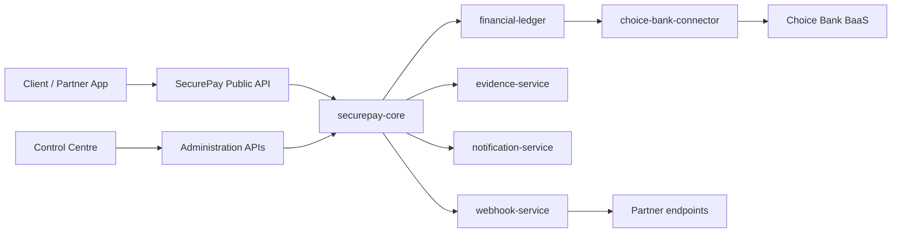

# SecurePay Master Architecture

**Status:** Current architectural decision (Phase 1 foundation)  
**Last updated:** 2026-07-22  
**Branch:** `phase-01-foundation`

## Classification legend

Throughout SecurePay documentation:

| Label | Meaning |
| --- | --- |
| **Locked doctrine** | Non-negotiable product and financial rule |
| **Current architectural decision** | Approved direction; may evolve via ADR |
| **Confirmed contractual fact** | Stated in executed Choice–Keyman agreements |
| **Confirmed technical-documentation fact** | Explicitly supported by official Choice GitBook |
| **Engineering assumption** | Working hypothesis — not encoded as fact |
| **Pending external confirmation** | Requires Choice, legal, or commercial confirmation |
| **Future implementation requirement** | Planned but not built in current phase |

## Vision

SecurePay is an API-first, domain-first agreement and financial platform serving SecurePay clients, Keyman business solutions (RestOrder, Resident.ke, Estate.ke, MyHustle.ke, MyRide.ke), institutional partners, and approved external developers.

**Locked doctrine:** The frontend is a replaceable client. It may inform usability but must not dictate domain model, ledger structure, security controls, service boundaries, public API contracts, state transitions, Payment Ready, release authority, or Choice Bank integration.

## Deployable components

| Component | Purpose | Phase 1 status |
| --- | --- | --- |
| `securepay-core` | Identity, agreements, governance, Payment Ready evaluation, administration APIs | Scaffold only |
| `financial-ledger` | Authoritative double-entry ledger | Scaffold only |
| `choice-bank-connector` | Sole integration boundary to Choice Bank BaaS | Scaffold only |
| `evidence-service` | Evidence storage and processing | Scaffold only |
| `notification-service` | OTP, email, SMS orchestration | Scaffold only |
| `webhook-service` | Partner webhook delivery | Scaffold only |
| `securepay-control-centre` | Operational administration UI | Scaffold only |

**Current architectural decision:** Use modular architecture with selected isolated services. Do not create unnecessary microservices.

## Logical domain ownership (securepay-core)

Future domains owned by SecurePay Core:

- Authentication and sessions
- KS Number identity
- Profiles and organizations
- Partner applications
- SecureLinks and Group SecureLinks
- Conditions and milestones
- Governance and approvals
- Agreement Reviews
- Payment Ready evaluation
- Compliance controls
- Administration APIs

## Isolation boundaries

**Locked doctrine:** The following require strong isolation:

| Boundary | Rationale |
| --- | --- |
| Financial ledger | Authoritative money record; immutable postings |
| Choice Bank connector | Provider credentials, signing, callback verification |
| Evidence service | Sensitive documents; malware scanning; object storage |
| Notification service | OTP and messaging provider credentials |
| Webhook service | Partner endpoint delivery; retry semantics |

Logical domain ownership is documented separately from deployment topology. A domain may start inside `securepay-core` and split later via ADR without changing doctrine.

## Request and command flow (target)

**Locked doctrine:** No client calls Choice Bank directly. No client edits ledger balances directly.

## Data stores

| Store | Role | ADR |
| --- | --- | --- |
| PostgreSQL | System of record for agreements, identity, operational data | [ADR-0003](../decisions/ADR-0003-POSTGRESQL-SYSTEM-OF-RECORD.md) |
| Redis-compatible cache | Sessions, rate limits, ephemeral coordination | Current architectural decision |
| Object storage | Evidence and export artifacts | Future implementation requirement |

**Locked doctrine:** Permanent files must not be stored on local application disks.

## API and contract foundation

- OpenAPI 3.1: [`contracts/openapi/securepay-api-v1.yaml`](../../contracts/openapi/securepay-api-v1.yaml)
- Event envelope: [`contracts/events/event-envelope-v1.schema.json`](../../contracts/events/event-envelope-v1.schema.json)
- Error envelope: [`contracts/errors/error-envelope-v1.schema.json`](../../contracts/errors/error-envelope-v1.schema.json)

Phase 1 exposes health endpoints only. Domain endpoints are added in later phases behind versioned contracts.

## Cross-cutting controls

| Control | Requirement |
| --- | --- |
| Idempotency | Every financial command must be idempotent |
| Audit | Identity, agreement, governance, review, security, and financial actions must be audited |
| Authorization | Object-level checks on every mutating API |
| Payment Ready | Calculated by backend domain logic only — never assigned by clients or admins |
| Provider outages | Must not corrupt SecurePay state |

## Phase 1 exclusions

**Confirmed:** Phase 1 does not implement production business services, KS Number tables, authentication, SecureLink state machine, Payment Ready engine, ledger tables, or Choice API calls.

## Related documents

- [Operating Doctrine](../doctrine/SECUREPAY_OPERATING_DOCTRINE.md)
- [Application–Infrastructure Contract](../handover/APPLICATION_INFRASTRUCTURE_CONTRACT.md)
- [Security Baseline](../security/SECUREPAY_SECURITY_BASELINE.md)
- [Control Centre Requirements](../operations/CONTROL_CENTRE_REQUIREMENTS.md)
- [Unresolved Items Register](../operations/UNRESOLVED_ITEMS_REGISTER.md)

## Architectural decision records

- [ADR-0001 API-first, domain-first](../decisions/ADR-0001-API-FIRST-DOMAIN-FIRST.md)
- [ADR-0002 Modular platform boundaries](../decisions/ADR-0002-MODULAR-PLATFORM-BOUNDARIES.md)
- [ADR-0003 PostgreSQL system of record](../decisions/ADR-0003-POSTGRESQL-SYSTEM-OF-RECORD.md)
- [ADR-0004 Choice Bank adapter boundary](../decisions/ADR-0004-CHOICE-BANK-ADAPTER-BOUNDARY.md)
- [ADR-0005 Control Centre no direct database access](../decisions/ADR-0005-CONTROL-CENTRE-NO-DIRECT-DATABASE-ACCESS.md)
