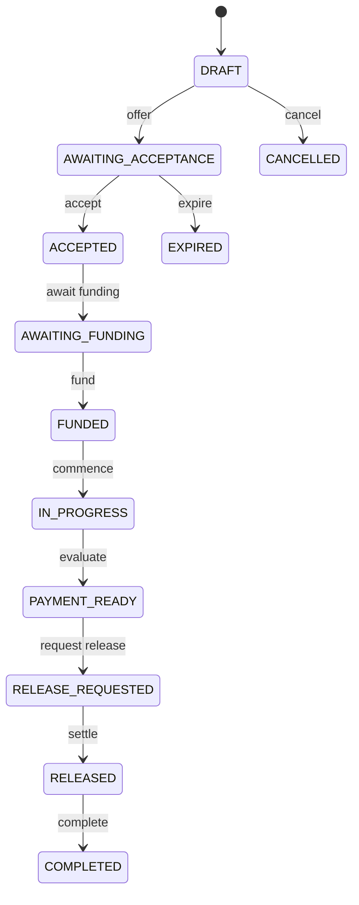

# SecureLink State Machine

**Status:** Locked doctrine (states and principles); transition matrix — future implementation requirement  
**Phase:** 1 — documentation only (no state machine implementation in this phase)

## Definition

A **SecureLink** is a versioned agreement involving:

- identifiable parties
- agreed value or obligation
- deliverables
- conditions
- milestones
- evidence
- approvals
- reviews
- Payment Ready evaluation
- release rules
- settlement

**Locked doctrine:** Money should follow the agreement recorded in the applicable SecureLink version.

## Conceptual states

| State | Description |
| --- | --- |
| `DRAFT` | Agreement being composed; not yet offered |
| `AWAITING_ACCEPTANCE` | Offered to required parties |
| `ACCEPTED` | Required parties accepted the applicable version |
| `AWAITING_FUNDING` | Accepted but funding incomplete |
| `PARTIALLY_FUNDED` | Some required funding received |
| `FUNDED` | Required funding confirmed per agreement rules |
| `IN_PROGRESS` | Work or delivery underway |
| `EVIDENCE_REQUIRED` | Evidence needed before progression |
| `AWAITING_APPROVAL` | Governance approval pending |
| `UNDER_REVIEW` | Agreement Review in progress |
| `PAYMENT_READY` | Backend determined release preconditions satisfied |
| `RELEASE_REQUESTED` | Release initiated per rules |
| `RELEASE_PROCESSING` | Settlement/release in flight |
| `PARTIALLY_RELEASED` | Partial release completed |
| `RELEASED` | Release completed per rules |
| `COMPLETED` | Terminal success state |
| `CANCELLED` | Terminal cancelled state |
| `EXPIRED` | Terminal expired state |
| `RESTRICTED` | Operational or compliance restriction active |
| `REFUNDED` | Funds returned per agreement or policy |

## Principles

| Classification | Rule |
| --- | --- |
| **Locked doctrine** | Not every SecureLink passes through every state. |
| **Locked doctrine** | State transitions are explicit and validated by backend domain logic. |
| **Locked doctrine** | Agreement terms may not be silently overwritten. |
| **Locked doctrine** | Material amendments create a new version. |
| **Locked doctrine** | Required parties must accept the applicable version. |
| **Locked doctrine** | Clients request actions; backend logic authorizes transitions. |
| **Locked doctrine** | Funding does not automatically mean Payment Ready. |
| **Locked doctrine** | Payment Ready does not mean settlement succeeded. |
| **Locked doctrine** | Agreement Reviews may pause or block release. |
| **Locked doctrine** | SecurePay is not automatically a guarantor of every trade. |
| **Locked doctrine** | Reviews do not remove lawful rights. |

## Versioning

| Classification | Rule |
| --- | --- |
| **Locked doctrine** | Each material change produces a new agreement version. |
| **Current architectural decision** | Payment Ready evaluation always records the agreement version evaluated. |

## Client interaction model

This diagram is illustrative. Actual allowed transitions depend on agreement type and conditions.

## Phase 1 scope

**Confirmed:** No SecureLink persistence, APIs, or transition engine are implemented in Phase 1.

## Related documents

- [Payment Ready Doctrine](PAYMENT_READY_DOCTRINE.md)
- [Financial Ledger Doctrine](FINANCIAL_LEDGER_DOCTRINE.md)
- [Master Architecture](../architecture/SECUREPAY_MASTER_ARCHITECTURE.md)
